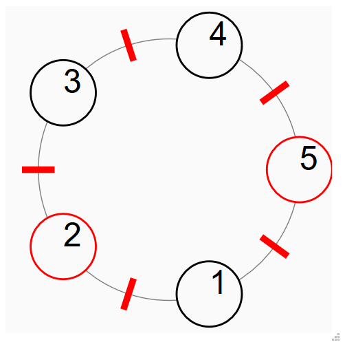

# The dining philosophers problem model for Runway

[try this model in Runway](https://runway.systems/?model=github.com/nirmaldalmia/dining-philosophers)

This is a model of [the dining philosophers problem](https://en.wikipedia.org/wiki/Dining_philosophers_problem) for
[Runway](https://github.com/salesforce/runway-browser). It includes a
`.model` file describing the state and how it changes, as well as a `.js` file
which can be used with
[runway-browser](https://github.com/salesforce/runway-browser) to produce an
visualization.
